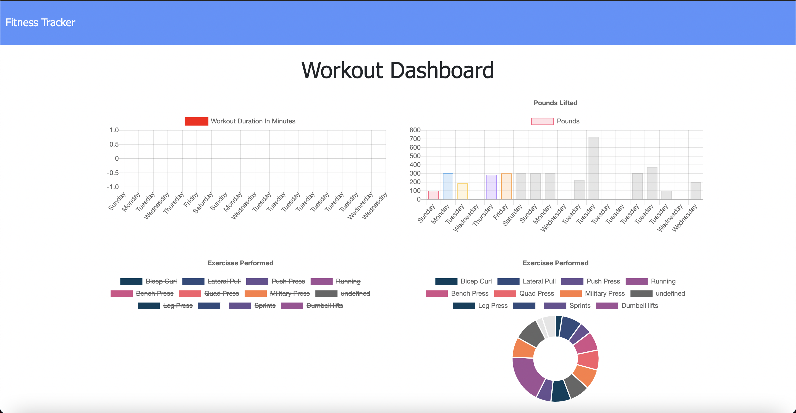

# Workout Tracker

## Summary

The Workout Tracker app is a web based app that allows a user to track their workouts for the week, input stats depending on the type of workout chosen, and view the stats on a dashboard that is populated from stored inforrmation in a MongoDB server.
## User Story

* As a user, I want to be able to view create and track daily workouts. I want to be able to log multiple exercises in a workout on a given day. I should also be able to track the name, type, weight, sets, reps, and duration of exercise. If the exercise is a cardio exercise, I should be able to track my distance traveled.

## Acceptance Criteria

When the user loads the page, they should be given the option to create a new workout or continue with their last workout.

The user should be able to:

  * Add exercises to the most recent workout plan.

  * Add new exercises to a new workout plan.

  * View the combined weight of multiple exercises from the past seven workouts on the `stats` page.

  * View the total duration of each workout from the past seven workouts on the `stats` page.

## Application Screenshot

## Techonlogies

- Express
- MongoDB
- NodeJS
- JavaScript
- Bootstrap
- Heroku

## Instructions

- None

## Links

- [Deployed Application](https://mgpl-workout-tracker.herokuapp.com/)
- [Github Repository](https://github.com/mgpierrelouis/Workout_Tracker)

## Licenses

Contact me on [Github](https://github.com/mgpierrelois) with any other questions